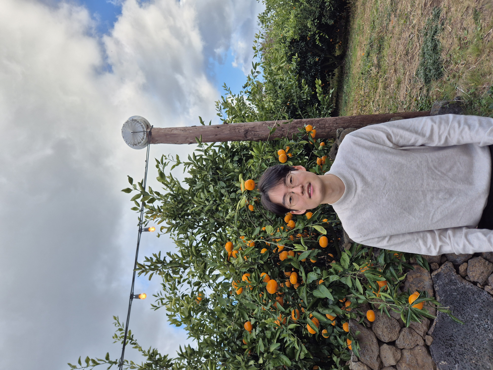

<meta name="viewport" content="width=device-width, initial-scale=1.0">

<link rel="stylesheet"
      href="https://cdnjs.cloudflare.com/ajax/libs/font-awesome/6.5.1/css/all.min.css">

<i class="fa-solid fa-location-dot"></i> Republic of Korea  
<i class="fa-regular fa-envelope"></i> parkjonggeon@kaist.ac.kr  
<i class="fa-brands fa-github"></i> <a href="https://github.com/Park-Jong-Geon">GitHub</a>  
<i class="fa-brands fa-google-scholar"></i> <a href="https://scholar.google.com/citations?user=jKGjOb4AAAAJ">Google Scholar</a>

<h2>About</h2>

Welcome, and thank you for visiting my homepage. 
 
I am currently a student at CHA University Graduate School of Medicine, with a strong academic interest in artificial intelligence and its applications in medicine. Prior to pursuing medical training, I received my master’s degree from Kim Jaechul Graduate School of Artificial Intelligence at KAIST, under the supervision of Professor Juho Lee, following a bachelor’s degree in Electrical Engineering, also from KAIST. 
 
During my master’s studies, I focused on generative models—particularly diffusion models and flow matching—with an emphasis on extending their applicability beyond image-based domains. Through this work, I developed a growing interest in AI-driven drug discovery and protein generation. These experiences ultimately shaped my broader vision of artificial intelligence as a transformative force in medicine and motivated my decision to pursue medical training. 
 
I believe, as many do, that the integration of artificial intelligence into clinical practice will fundamentally expand the boundaries of medicine in the near future. I hope to contribute to this ongoing transformation as a clinician-scientist. I welcome any discussions on medical AI research, interdisciplinary collaboration, and the future role of artificial intelligence in clinical medicine.

<h2>Publications</h2>

Axial Neural Networks for Dimension-Free Foundation Models

Hyunsu Kim, <strong>Jonggeon Park</strong>, Joan Bruna, Hongseok Yang, Juho Lee 
<em>The Thirty-ninth Annual Conference on Neural Information Processing Systems (NeurIPS)</em>, 2025  

<a href="https://arxiv.org/pdf/2510.13665" target="_blank">[Paper]</a>

Ensemble Distribution Distillation via Flow Matching

<strong>Jonggeon Park</strong>*, Giung Nam*, Hyunsu Kim, Jongmin Yoon, Juho Lee 
<em>Forty-second International Conference on Machine Learning (ICML)</em>, 2025  

<a href="https://openreview.net/pdf?id=waeJHU2oeI" target="_blank">[Paper]</a>

<a href="https://github.com/Park-Jong-Geon/EDFM" target="_blank">[GitHub]</a>

Stabilizing the training of consistency models with score guidance

Jeongjun Lee*, <strong>Jonggeon Park</strong>*, Jongmin Yoon, Juho Lee 
<em>ICML 2024 Workshop on Structured Probabilistic Inference & Generative Modeling</em>, 2024  

<a href="https://openreview.net/pdf?id=6Q5828tzlp" target="_blank">[Paper]</a>

<a href="https://github.com/boingkiri/stabilizing_consistency" target="_blank">[GitHub]</a>

  

